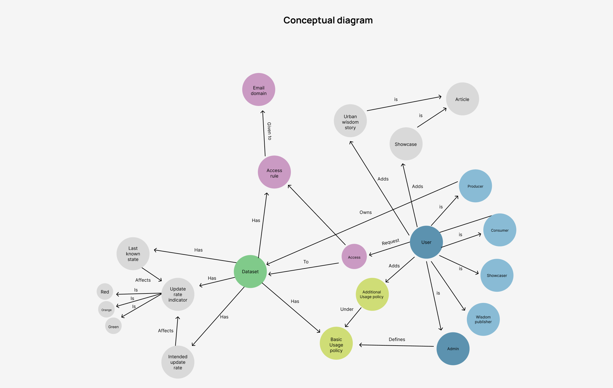
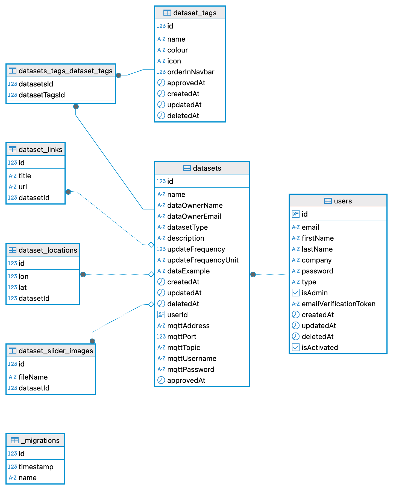

# Digital Frontiers Documentation Overview

This repository contains comprehensive documentation and resources for the Digital Frontiers platform. Below is an overview of the contents of the [`docs/`](docs/) folder, including visual assets and diagrams that illustrate the system architecture, conceptual models, and other key aspects of the project.

---

## 📁 `docs/` Folder Structure

- **[`libraries-arch.drawio`](docs/libraries-arch.drawio)**  
  Editable diagram file showing the libraries and architecture used in the project.

- **[`PermissionMatrix.md`](docs/PermissionMatrix.md)**  
  Markdown table outlining user roles and permissions across the platform.

- **`conceptual-diagram/`**  
  - [`conceptual-diagram-v2.jpg`](docs/conceptual-diagram/conceptual-diagram-v2.jpg)  
    
  - [`conceptual-diagram.drawio`](docs/conceptual-diagram/conceptual-diagram.drawio)  
    Editable source for conceptual diagrams.
  - `v2-versioning-plan/`  
    Contains versioning plans and related diagrams.

- **`tech-stack/`**  
  - [`tech-stack-v3.jpg`](docs/tech-stack/tech-stack-v3.jpg) 
  

- **`personas/`**  
  User personas and user journey documentation.

- **`resources/`**  
  Additional documentation resources and references.

- **`tech-stack/`**  
  Details and diagrams about the technology stack used.

- **`wireframes/`**  
  UI/UX wireframes and design assets.

---

## 📸 Visual Documentation

Below are some of the key diagrams and images included in the documentation:

### System Architecture

### Conceptual Diagrams

- **Version 0:**  
  
- **Version 1:**  
  
- **Version 2:**  
  

### Database Design

---

## 📄 Other Documentation

- **Permission Matrix:**  
  See [`PermissionMatrix.md`](docs/PermissionMatrix.md) for a detailed breakdown of user roles and access rights.

- **Personas & User Journeys:**  
  The [`personas/`](docs/personas/) folder contains documents describing typical users and their interactions with the platform.

- **Wireframes & UI Design:**  
  Explore [`wireframes/`](docs/wireframes/) for early-stage UI/UX designs.

---

For more details on the codebase and how to contribute, see the [`src/README.md`](src/README.md) and [`src/frontend/README.md`](src/frontend/README.md).

---