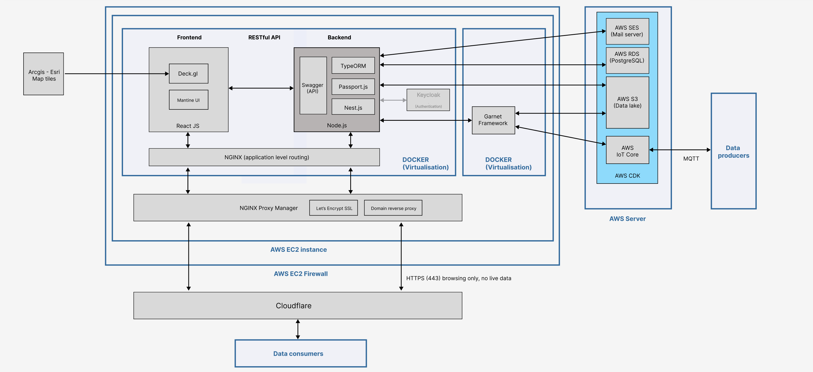

# Digital Frontiers Documentation Overview

This repository contains comprehensive documentation and resources for the Digital Frontiers platform.

---

## 📚 Documentation Structure

- **General video (covers manager and users) (For ID)**
    - A comprehensive video tutorial about the Digital Frontiers platform is available on LLDC's Drive. The tutorial covers:
        - Platform introduction and explanation of all features.
        - How-to-use guides for both normal users and admins.
        - Overview of admin responsibilities.
        - User-oriented scenarios, including:
            - Demonstration of a normal user creating showcases and datasets.
            - How admins approve requests, with practical notes.
        - Platform settings, user management, and statistics in the admin dashboard.
    - Please refer to the LLDC Drive for access to the video.

- **Platform manager**
    - [Admin responsibilities & approval process](docs/admin-responsibilities.md)
    - Manage datasets & tags
    - Manage showcases
    - Manage users
    - Settings

- **Platform design**
    - Conceptual diagram
    - Database
    - Personas
    - Architecture
    - Wireframes
    - Code structure
    - License BOM
    - Deployment notes (AWS, EC2, SES, Cloudflare, etc. + future optimisation [EC2 tiers, locations: money vs. performance vs. data protection...])
    - Backlog (next version)
        - Garnet
        - Wisdom layer
        - Incoming from feedback
    - Feedbacks
    - Presentations

---

## 📁 `docs/` Folder Structure

- **`conceptual-diagram/`**  
  - [`conceptual-diagram-v2.jpg`](docs/conceptual-diagram/conceptual-diagram-v2.jpg)  
    
  - [`conceptual-diagram.drawio`](docs/conceptual-diagram/conceptual-diagram.drawio)  
    Editable source for conceptual diagrams.
  - `v2-versioning-plan/`  
    Contains versioning plans and related diagrams.

- **`tech-stack/`**  
  - [`tech-stack-v3.jpg`](docs/tech-stack/tech-stack-v3.jpg) 
  

- **`personas/`**  
  User personas and user journey documentation.

- **`resources/`**  
  Additional documentation resources and references.

- **`tech-stack/`**  
  Details and diagrams about the technology stack used.

- **`wireframes/`**  
  UI/UX wireframes and design assets.

---

## 📄 Other Documentation

- **Permission Matrix:**  
  See [`PermissionMatrix.md`](docs/PermissionMatrix.md) for a detailed breakdown of user roles and access rights.

- **Admin Responsibilities & Approval Process:**  
  See [`admin-responsibilities.md`](docs/admin-responsibilities.md) for a comprehensive guide to admin tasks, approvals, and management features.

- **Personas & User Journeys:**  
  The [`personas/`](docs/personas/) folder contains documents describing typical users and their interactions with the platform.

- **Wireframes & UI Design:**  
  Explore [`wireframes/`](docs/wireframes/) for early-stage UI/UX designs.

---

For more details on the codebase and how to contribute, see the [`src/README.md`](src/README.md) and [`src/frontend/README.md`](src/frontend/README.md).

---