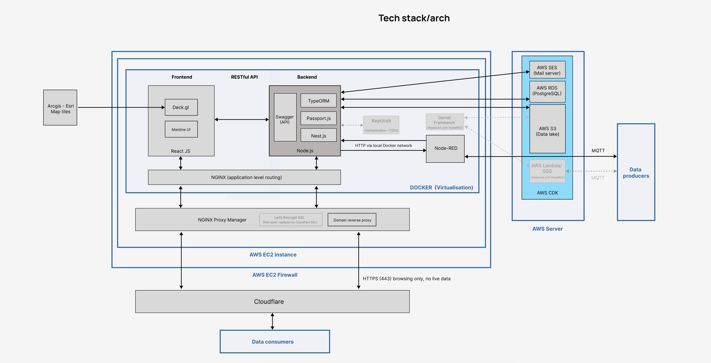

# Digital Frontiers Documentation Overview

This repository contains comprehensive documentation and resources for the Digital Frontiers platform.

---

## 📚 Content Guide

- **General video (covers manager and users)**
    - A comprehensive video tutorial about the Digital Frontiers platform is available on LLDC's Drive.

- **Platform manager**
    - [Admin responsibilities & approval process](docs/admin-responsibilities.md)
  
- **Platform design**
    - Conceptual diagram
    - Database
    - Personas
    - Architecture
    - Wireframes
    - Tech stack
    - Code structure
    - Deployment notes
    - Backlog (next version)
        - [Next version: Garnet & Wisdom layer](docs/next-version.md)
    - Feedbacks and Presentations

---

## 📁 docs/ Folder Structure

- **Conceptual diagram**
  - [`conceptual-diagram-v2.jpg`](docs/conceptual-diagram/conceptual-diagram-v2.jpg)  
    
  - [`conceptual-diagram.drawio`](docs/conceptual-diagram/conceptual-diagram.drawio)  
    Editable source for conceptual diagrams.
  - `v2-versioning-plan/`  
    Contains versioning plans and related diagrams.

- **Database**
  - [`ER-Diagram-v6.png`](docs/database/ER-Diagram-v6.png)  
    Entity-relationship diagram for the platform database.

- **Personas**
  - [`personas/`](docs/personas/)  
    User personas and user journey documentation.

- **Architecture**
  - [`libraries-arch.drawio`](docs/libraries-arch.drawio)  
    Editable diagram file showing the libraries and architecture used in the project.

- **Wireframes**
  - [`wireframes/`](docs/wireframes/)  
    UI/UX wireframes and design assets.

- **Tech stack**
  - [`tech-stack/`](docs/tech-stack/)  
    Details and diagrams about the technology stack used.
  - [`tech-stack-v3.jpg`](docs/tech-stack/tech-stack-v4.jpg)  
    

- **Code structure**
  - See [`docs/code-structure.md`](docs/code-structure.md) for the detailed code structure documentation.

---

## 🎥 General Video

A comprehensive video tutorial about the Digital Frontiers platform is available on LLDC's Drive. The tutorial covers:

- Platform introduction and explanation of all features.
- How-to-use guides for both normal users and admins.
- Overview of admin responsibilities.
- User-oriented scenarios, including:
    - Demonstration of a normal user creating showcases and datasets.
    - How admins approve requests, with practical notes.
- Platform settings, user management, and statistics in the admin dashboard.

Please refer to the LLDC Drive for access to the video.

---

## 📄 Other Documentation

- **Permission Matrix:**  
  See [`PermissionMatrix.md`](docs/PermissionMatrix.md) for a detailed breakdown of user roles and access rights.

- **Admin Responsibilities & Approval Process:**  
  See [`admin-responsibilities.md`](docs/admin-responsibilities.md) for a comprehensive guide to admin tasks, approvals, and management features.

- **Personas & User Journeys:**  
  The [`personas/`](docs/personas/) folder contains documents describing typical users and their interactions with the platform.

- **Wireframes & UI Design:**  
  Explore [`wireframes/`](docs/wireframes/) for early-stage UI/UX designs.

---

## 🚀 Deployment Notes

The platform is deployed using the following stack:

- **AWS EC2**: Hosts Docker containers for backend, frontend, and database.
- **AWS SES**: Handles transactional and notification emails.
- **Cloudflare**: Sits in front of the reverse proxy for DNS, SSL, and security.
- **Nginx Proxy Manager**: Used as a reverse proxy to route traffic to the correct services.

### EC2 Tiers & Regions

Currently, the platform runs on an xlarge EC2 instance with 16 GB of RAM. This is sufficient for the expected low user numbers at present, and there are no immediate plans to upgrade.

The deployment uses the `us-east-1` AWS region, which is the most cost-effective option. However, this region does not provide optimal performance for users based in London, as it introduces higher latency.

If user numbers grow significantly, or if data protection requirements (such as GDPR or UK-specific regulations) become more stringent, it may be necessary to migrate to a UK or EU region (e.g., `eu-west-2` for London). This would improve performance for UK-based users and ensure compliance with local data protection laws, but would also increase hosting costs.

---

For more details on the codebase and how to contribute, see the [`src/README.md`](src/README.md) and [`src/frontend/README.md`](src/frontend/README.md).

---